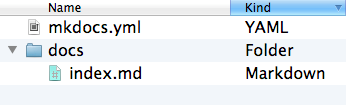
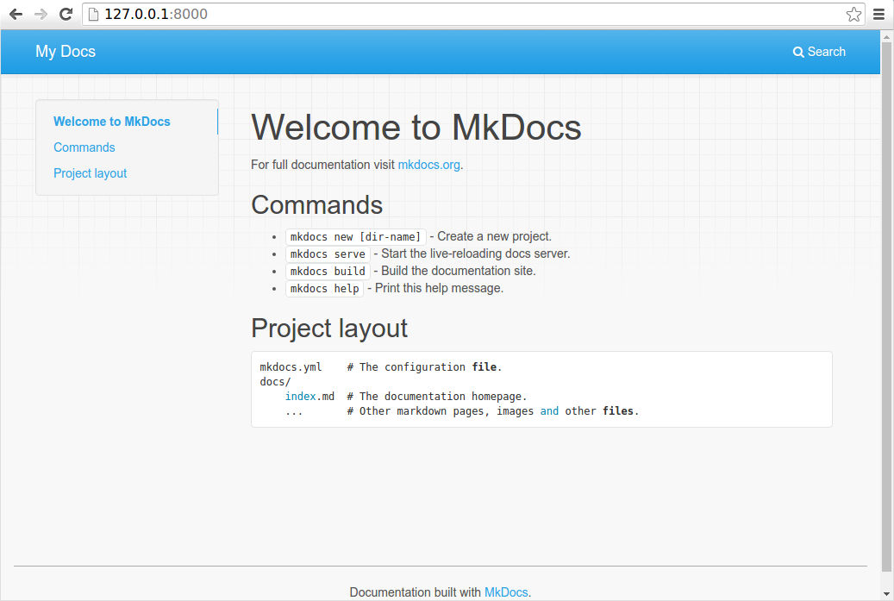
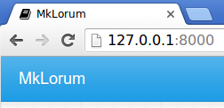

# Getting Started with MkDocs
<center>An introductory tutorial!</center>

## Installation
For more details, see the [Installation Guide](https://www.mkdocs.org/user-guide/installation/).  
To install MkDocs, run the following command from the command line:
```bash
pip install mkdocs mkdocs-material
```
## Creating a new project
```
mkdocs new robot-knowledge
cd robot-knowledge
```
Take a moment to review the initial project that has been created for you.  


There's a single configuration file named mkdocs.yml, and a folder named docs that will contain your documentation source files (docs is the default value for the docs_dir configuration setting). Right now the docs folder just contains a single documentation page, named index.md.

MkDocs comes with a built-in dev-server that lets you preview your documentation as you work on it. Make sure you're in the same directory as the mkdocs.yml configuration file, and then start the server by running the mkdocs serve command:

```
$ mkdocs serve
INFO    -  Building documentation...
INFO    -  Cleaning site directory
INFO    -  Documentation built in 0.22 seconds
INFO    -  [15:50:43] Watching paths for changes: 'docs', 'mkdocs.yml'
INFO    -  [15:50:43] Serving on http://127.0.0.1:8000/
```  
Open up http://127.0.0.1:8000/ in your browser, and you'll see the default home page being displayed:  
 

The dev-server also supports auto-reloading, and will rebuild your documentation whenever anything in the configuration file, documentation directory, or theme directory changes.

Open the docs/index.md document in your text editor of choice, change the initial heading to MkLorum, and save your changes. Your browser will auto-reload and you should see your updated documentation immediately.

Now try editing the configuration file: mkdocs.yml. Change the site_name setting to MkLorum and save the file.  

```site_name: MkLorum```  
Your browser should immediately reload, and you'll see your new site name take effect.  
   
Note: The site_name configuration option is the only required option in your configuration file.

